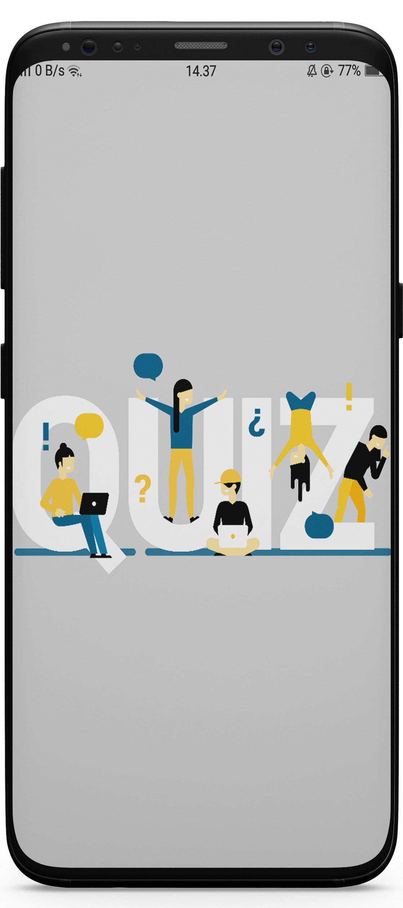
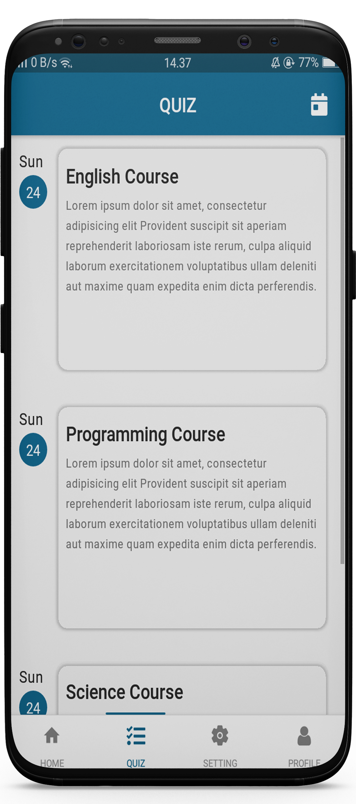
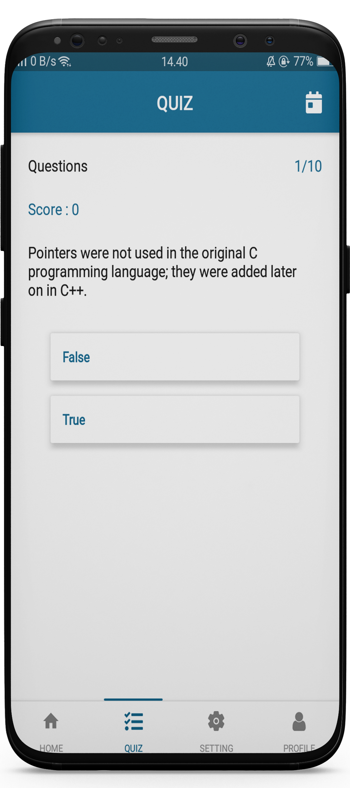
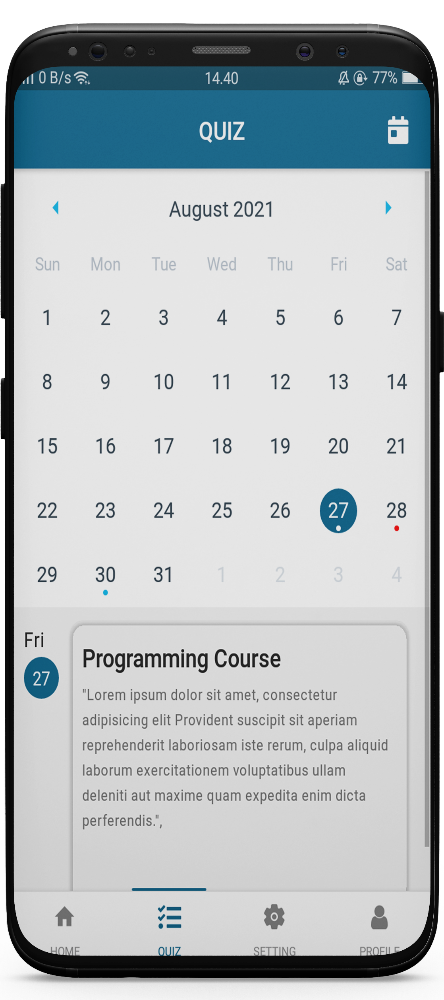
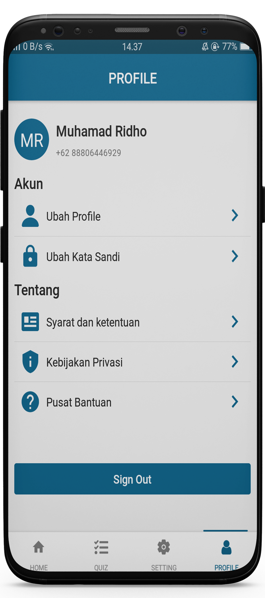

### About

Quizz is an application that I made for practice. because I've learned about the typescript programming language, and I'm trying to retrieve data from the opentdb.com API

### Screenshot

